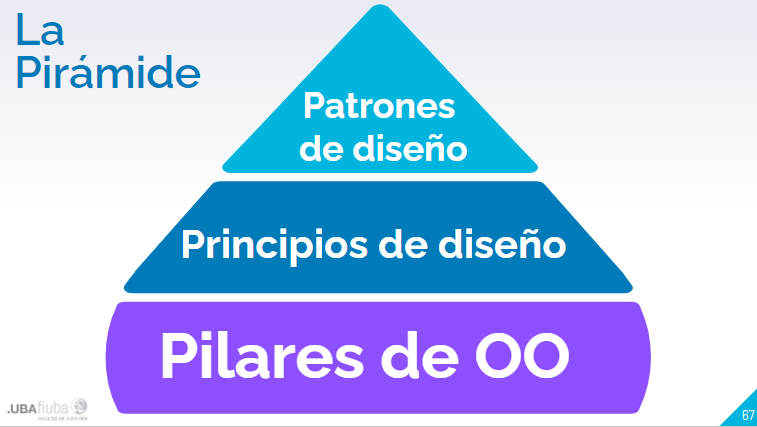

# patrones de diseño

alguien seguramente ya resolvio tus problemas de diseño, por tanto si lo hizo exitosamente podemos aprovechar su solucion para mejorarlas nuestras

## la unica constante

- no importa donde trabjes
- ni que app construyas
- o lenguaje de programacion que uses

**la unica constante es el cambio**

## encapsular variabilidades

identifique los aspectos de su aplicacion que varien y separelo de lo que permanece igual

tome las partes que varien y encapsulelas de forma tal que luego pueda modificar o escalar las partes que varian 

basicamente a la hora de modelar es util poder separar aquellos comportamiento que varian y aislarlo mediante una interfaz o clase

## programar contra interfaces

programar contra interfaces no contra implementaciones

a mas abtracta se la clase declarada menos modificaciones tendre que hacer

las interfaces son menos volatiles

esto hasta permite setear comportamientos

## componer sobre heredar

favorezca la composicion sobre la herencia

el "tiene un" es mejor que un "es un", si en vez de usar herencia uso composicion puedo por ejemplo cambiar comportamientos en tiempo de ejecucion.

**todo esto corresponde con el patron strategy**

## patron strategy

define una familia de algoritmos encapsulado cada uno y pudiendo asi intercambiarlos

## poder del vocabulario comun

- ayudan a decor mas con menos
- hablar nivel patrones permite mantenernos en "el diseño" por mas tiempos
- empodera al equipo de trabjo
- anima a los menos experimentados a agarra el librito

## como se define un patron de diseño

es una solucion a un problema en un contexto

## partes

### contexto

es una situacion donde el patron se aplica, para esto debe ser frecuente

### problema

es el objetivo que se quiere alcanzar en el contexto, pero tambien se refiere a las restricciones del mismo contexto

### solucion

es un diseño general que cualquiera puede aplicar y resuelve el objetivo y sus restricciones

## contraindicaciones

- debemos saber que tan recurrente es
- debe ser una solucion repetible
- no todos van a repetir esa solucion de la misma manera
- debe tener nombre

## definicion formal

las definiciones formales de patrones se encuentran en un catalogo

## formato de catalogo

- nombre
- categoria:esta ya segmentada
- intencion: Describe lo que hace el patrón en una breve oración. Se puede pensar en esto como la definición de patrón.
- motivacion: brinda un escenario concreto donde surgio el patron describe el problema y como resolverlo
- aplicabilidad: son situaciones donde se puede aplicar
- estructura (notada en uml)
- participantes: clases y objetos del diseño, describe responsabilidades
- colaboraciones: nos dice como trabajan entre si las clases
- consecuencias:describe efectos deseados y no deseados de usar el patron
- implementacion: ejemplos de codigo
- usos conocidos: describe ejemplos del patron encontrados en sistemas reales
- patrones relacionados: describe la relacion entre este patron y otros

## categorias:

### creacionales: 

implica la creacion de clases y objetos y todos proporcionan maneras de desacoplar a un cliente los objetos que necesita instanciar

### comportamiento: 

Se preocupa por cómo las clases y los objetos interactúan entre sí y distribuyen la responsabilidad.

### estructurales:

Permiten componer clases u objetos en estructuras más grandes

## ejemplos:

### creacionales:

-Singleton
-Builder
-Prototype
-Factory Method
-Abstract Factory

### comportamiento

-Strategy
-State
-Template Method
-Command
-Iterator
-Observer
-Visitor
-Chain of Responsibility

### estructurales

-Decorator
-Composite
-Proxy
-Facade
-Adapter
-Bridge
-Flyweight

## principio de KISS (keep it simple stupid)

es un principio consiste en que uno tiene que buscar que el codigo sea los mas simple y sencillo posible, no siempre puedo lograr eso aplicando patrones ( a veces mas bien lo contrario)

## bala de plata

los patrones no son magicos, por mas utiles que sean hay que implementarlos

## refactoring

durante los refactoring es ideal verificar si se podrian aplicar patrones(libro recomendado: refactoring to patterns)

## sin miedo

a veces hay que ir para atras con un patron cuando el sistema se complejizo demasiado

## donde va el focus

en el diseño, entre pilares, principios y si patrones se tiene multiples herramientas pero fin siempre es hacer un diseño solido y para ello se usan todas las herramientas enunciadas

## patrones de diseño en otras disciplinas

### arquitectura

Se utilizan para crear la arquitectura viva y vibrante de edificios, pueblos y ciudades. Es por donde comenzaron a emerger los patrones inicialmente.

### en procesos de negocio

Describen la interacción entre empresas, clientes y los datos. Se puede aplicar a problemas tales como cómo tomar y comunicar decisiones de manera efectiva.

### a nivel organizacion

Describen las estructuras y prácticas de las organizaciones humanas. La mayoría de los esfuerzos hasta la fecha se han centrado en organizaciones que producen y / o dan soporte a software.

## antipatrones

es algo que suena como una solucion pero no lo es

## golden hammer

es el antipatron mas conocido, conciste en la ignorancia de cualquier herramienta no conocida por quien diseña una solucion, se procura que solo usar herramientas que se conocen ignorando alternativas que quizas sean mejores

## piramide de jerarquia en POO

## tips finales

- permitir que surjan los patrones, no forzarlos
- los patrones no estan tallado en piedra (se pueden adaptar)
- usar siempre el mas simple
- mantenerse al dia con los nuevos patrones