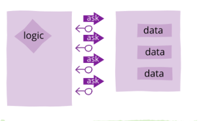
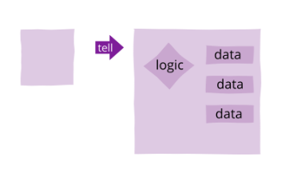

# tell don't ask

tell don't ask "decir no preguntar" es un principio cuya base es mover la extraccion y el manejo de datos directamente a las clases que los proveen, es decir en vez de tener la logica de una clase de un lado y los datos del otro, es mejor tener ambos en una misma clase

## ask

## tell

pilar principal de la programacion orientada a objetos es poder aunar en un objeto tanto estados como comportamientos y este principio es escencial para dicha tarea ya que en la mayoria de casos cuando datos y logica estan tan estrechamente relacionados es mejor juntarlos.