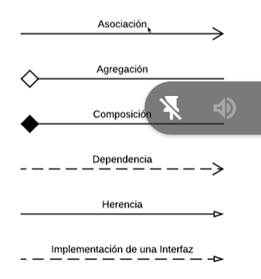

# Clase UML

## como notar en uml

### nombre de clase

 - visibilidad atributo: tipo
 - visibilidad metodo(parametro): tipo

## ambitos

### miembro de intancia: 

- valores der los atributos que varian segun instancia
- invocacion de metodos puede afectar al estado de las intancia

### miembros de clase: 
 lorem ipsum

## herencia
 
 clase abstracta -> italica
 herenca es flecha solida sin rellenar

## cuidado con las clases vacias

nada de frula vos tenes que poner todo en el uml asi sean atributos y metodos heredados

## asociacion

es una flechita sin rellenar (asociacion simple) se interpreta como tiene o usa
si hay asociacion entonces no pones como atributo la clase a la que asocias

## colecciones: 
son relaciones donde un objeto tiene varias instancias de otro, en la flechita se señaliza el tipo de relacion que existe (1 a 1, 1 a *, etc)

implementa como se te canta el orto pero uml me permite saber que existe dicha relacion

siempre busco que sea los mas legible, si tengo una clase asociado a otra siendo por ejemplo de 1 a1 entonces se pone como atributo y en otro diagrama se detalla mas la misma clase

## multiplicidad en instancias

1 uno
0..1 cero a uno
n...m desde n hasta m
* 0 o varios
0..* mismo
1..* uno a n

eso seria bidireccional (no hay punto en la flechita),  no es lo mas comun
 
## aclaracion sobre asociacion

- una flechita tiene un costo
- el sentido de la flecha es importante (si una flecha va de una a otra la otra no puede pedirle ni referenciar en nada a la primera)

## agregacion y composicion

### agregacion

agregacion se indica con el rombito el rombo señaliza al reves, o sea a donde apunta el rombo se lee para el lado contrario
tambien indica fuerza en cuanto a la relacion de los objetos (es decir un cambio en una clase puede impactar mucho a la otra)
 
### composicion
se indica con un rombo en oscuro y es similar que a la anterior uno depende del otro solo que directamente la vida la clase dependiente depende de la clase a la que depende en cuestion (no puede existir una intancia de una clase compuesta fuera de la clase de la que esta compuesta)

## dependencia

es la relacion mas debil, es una flecha punteada (significa un conoce), concretamente indica que no le pertenece a una clase tal pero si que la conoce (lo utiliza entre los parametros de sus metodos)

## interfaces

son clases con firmas sin implementacion se señaliza como <<interface>> solo tienen declaraciones de los metodos pero no se tiene nada implementado, se señalizan con la misma flecha que herencia, pero punteada.

## los constructores en UML

se deben mencionar primero entre los metodos de la clase con el mismo nombre que la clase

## aclaracion mas importante

TU UML NO TIENE ABSOLUTAMENTE NADA QUE VER CON TU CODIGO

## diagrama de secuencia

muestra como los objetos se envian mensajes entre si
en estos diagramas tenemos instancias, no la clase, tenes el objeto y la clase que lo intancia

lo dificil de estos diagramas es señalar un if, la manera de hacerlo es hacer varios diagramas por cada if